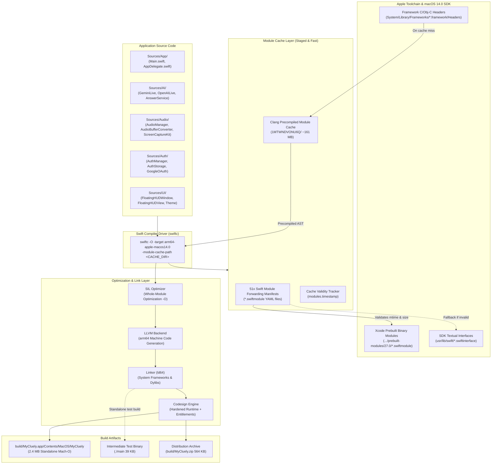
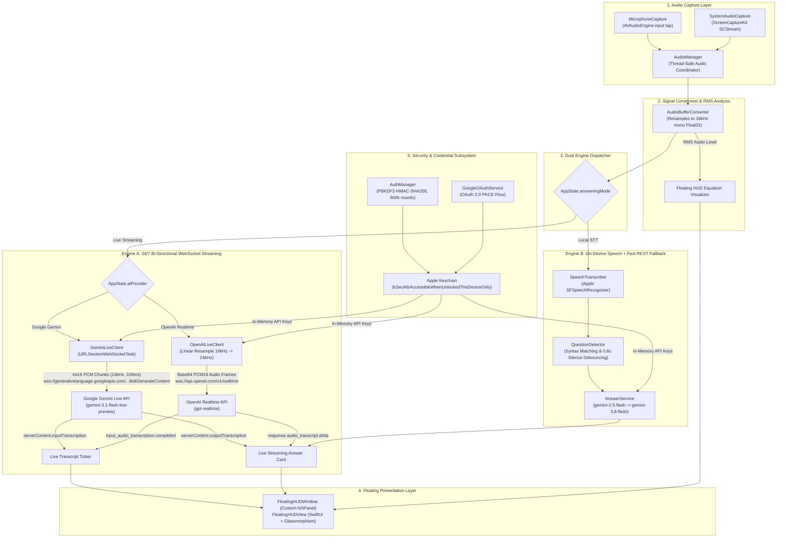

# Technical Architecture & Compilation Specification

> **Comprehensive Technical Architecture: Swift Module Compilation Pipeline, Precompiled Cache Staging, and MyCluely Native Runtime Engine**

---

## 📑 Table of Contents

1. [Architectural Scope & System Identity](#1-architectural-scope--system-identity)
2. [Swift Module Architecture & Compilation Pipeline](#2-swift-module-architecture--compilation-pipeline)
   - [The Modern Swift 6 Modular Compilation Model](#21-the-modern-swift-6-modular-compilation-model)
   - [Swift Interface Formats (.swiftinterface vs .swiftmodule)](#22-swift-interface-formats-swiftinterface-vs-swiftmodule)
   - [YAML Module Forwarding Descriptors](#23-yaml-module-forwarding-descriptors)
   - [Clang Precompiled Modules (PCM)](#24-clang-precompiled-modules-pcm)
   - [End-to-End Compilation Pipeline](#25-end-to-end-compilation-pipeline)
3. [Architecture Diagrams](#3-architecture-diagrams)
   - [Compilation & Module Cache Pipeline](#31-compilation--module-cache-pipeline-flowchart)
   - [MyCluely Application Runtime & Data Flow](#32-mycluely-application-runtime--data-flow)
4. [Module Dependency & Interface Layout](#4-module-dependency--interface-layout)
   - [Layer 0: Darwin, POSIX & C Runtime Primitives](#layer-0-darwin-posix--c-runtime-primitives)
   - [Layer 1: Concurrency & Runtime Shims](#layer-1-concurrency--runtime-shims)
   - [Layer 2: Objective-C Runtime & Core Services](#layer-2-objective-c-runtime--core-services)
   - [Layer 3: Foundation & Application State](#layer-3-foundation--application-state)
   - [Layer 4: Graphics, Rendering & Hardware Acceleration](#layer-4-graphics-rendering--hardware-acceleration)
   - [Layer 5: Media & Audio Capture Subsystems](#layer-5-media--audio-capture-subsystems)
   - [Layer 6: UI Presentation Layer](#layer-6-ui-presentation-layer)
   - [Layer 7: Cryptography & Security Infrastructure](#layer-7-cryptography--security-infrastructure)
5. [Build Cache & Precompiled Binary Architecture](#5-build-cache--precompiled-binary-architecture)
   - [Clang Module Cache Directory Hashing (1MTWNDVONU6Q)](#51-clang-module-cache-directory-hashing-1mtwndvonu6q)
   - [Anatomy of a Precompiled Module (.pcm)](#52-anatomy-of-a-precompiled-module-pcm)
   - [Cache Invalidation & Timestamp Mechanics (modules.timestamp)](#53-cache-invalidation--timestamp-mechanics-modulestimestamp)
   - [Build Staging & Sandboxing Mechanics](#54-build-staging--sandboxing-mechanics)
6. [Performance & Architectural Trade-offs](#6-performance--architectural-trade-offs)
   - [Cold vs Warm Compilation Benchmarks](#61-cold-vs-warm-compilation-benchmarks)
   - [Cache Storage vs Execution Velocity](#62-cache-storage-vs-execution-velocity)
   - [Portability & Toolchain Coupling](#63-portability--toolchain-coupling)
   - [Direct CLI Compiler (`swiftc`) vs Monolithic Xcode](#64-direct-cli-compiler-swiftc-vs-monolithic-xcode)
7. [Application Runtime Subsystems](#7-application-runtime-subsystems)
   - [Audio Pipeline & Sample Rate Conversion](#71-audio-pipeline--sample-rate-conversion)
   - [Dual Live Streaming Engines (Gemini & OpenAI)](#72-dual-live-streaming-engines-gemini--openai)
   - [Local STT & Question Detection](#73-local-stt--question-detection)
   - [Window Management & Glassmorphism](#74-window-management--glassmorphism)
   - [Authentication & Keychain Cryptography](#75-authentication--keychain-cryptography)

---

## 1. Architectural Scope & System Identity

The `lightweightfolder` environment represents an intersection between **modern Swift 6 compiler architecture** and **ultra-low-latency native macOS application design**.

Rather than relying on Xcode's bulky project bundles (`.xcodeproj`) and gigabyte-heavy `DerivedData` caches, this codebase executes directly against the Apple Swift toolchain via `swiftc`. The workspace captures:
1. The complete production source code for **MyCluely**, an ad-hoc signed, 2.4 MB floating HUD application for continuous audio monitoring and real-time AI streaming.
2. A staged **precompiled module cache** comprising 51 Swift module redirect manifests (`*.swiftmodule`) and 75 Clang Precompiled Modules (`1MTWNDVONU6Q/*.pcm`, ~161 MB) that optimize build performance by eliminating redundant parsing of macOS SDK interfaces.

---

## 2. Swift Module Architecture & Compilation Pipeline

### 2.1 The Modern Swift 6 Modular Compilation Model
In Swift 6, modular compilation decouples interface declarations from implementation binaries. When source code imports system frameworks such as `import AppKit` or `import Foundation`, the compiler does not include textual C header files sequentially (as in legacy C `#include`). Instead, it loads pre-compiled, semantically validated **modules**.

Apple platforms feature a hybrid module ecosystem:
- **Clang Modules**: For C, Objective-C, and Darwin system libraries (e.g., `Darwin`, `CoreGraphics`, `AppKit`, `AVFoundation`).
- **Swift Modules**: For pure Swift frameworks and Swift overlays (e.g., `Swift`, `SwiftUI`, `_Concurrency`, `Observation`).

### 2.2 Swift Interface Formats (.swiftinterface vs .swiftmodule)
The macOS SDK distributes API definitions in two formats:
1. **Textual Interface (`.swiftinterface`)**:
   - Located in `usr/lib/swift/<ModuleName>.swiftmodule/<arch>-apple-macos.swiftinterface` inside the Xcode SDK.
   - Human-readable, stable Swift source declaring public and `@usableFromInline` APIs.
   - Compiler-version agnostic across compatible language modes, enabling **Library Evolution**.
   - **Cost**: Compiling a large `.swiftinterface` into memory takes several seconds of CPU time per framework.
2. **Binary Module (`.swiftmodule`)**:
   - A serialized binary representation of the compiler's Abstract Syntax Tree (AST), symbol tables, and SIL (Swift Intermediate Language).
   - Fast to deserialize (<10ms).
   - Tied to a specific compiler build and architecture triple (e.g., `arm64-apple-macos14.0`).

### 2.3 YAML Module Forwarding Descriptors
When building in a staged or cached environment, the Swift driver generates **forwarding descriptor manifests** in the module cache directory. In this workspace, the 51 files ending in `.swiftmodule` in the root directory are UTF-8 YAML descriptor files rather than binary object files.

Each forwarding file defines:
- `path`: The absolute path to a precompiled binary `.swiftmodule` in the toolchain (e.g., `/Applications/Xcode.app/.../prebuilt-modules/27.0/AppKit.swiftmodule/arm64e-apple-macos.swiftmodule`).
- `dependencies`: An explicit list of SDK header files, `.apinotes`, and upstream `.swiftinterface` dependencies.
- `mtime` and `size`: Nanosecond-precision modification timestamps and byte sizes of each dependency.
- `sdk_relative`: A boolean flag indicating whether the path is resolved relative to the macOS SDK sysroot.

```yaml
---
path:            '/Applications/Xcode.app/Contents/Developer/Toolchains/XcodeDefault.xctoolchain/usr/lib/swift/macosx/prebuilt-modules/27.0/_Concurrency.swiftmodule/arm64e-apple-macos.swiftmodule'
dependencies:
  - mtime:           1788112736000000000
    path:            '/Applications/Xcode.app/Contents/Developer/Toolchains/XcodeDefault.xctoolchain/usr/lib/swift/macosx/prebuilt-modules/27.0/_Concurrency.swiftmodule/arm64e-apple-macos.swiftmodule'
    size:            792812
  - mtime:           1786222404000000000
    path:            'usr/lib/swift/Swift.swiftmodule/arm64e-apple-macos.swiftinterface'
    size:            2472314
    sdk_relative:    true
  - mtime:           1786222881000000000
    path:            'usr/lib/swift/_Concurrency.swiftmodule/arm64e-apple-macos.swiftinterface'
    size:            305509
    sdk_relative:    true
version:         1
...
```

If the SDK dependencies match the specified timestamps and sizes, the compiler driver bypasses `.swiftinterface` compilation and directly maps the prebuilt binary module.

### 2.4 Clang Precompiled Modules (PCM)
Because Swift interfaces with C and Objective-C frameworks through a unified type system, the Swift compiler embeds an instance of Clang. 

When an imported framework contains C or Objective-C declarations (such as `NSPanel` in `AppKit` or `SCStream` in `ScreenCaptureKit`), Clang parses the framework headers, evaluates macros, and serializes the AST into a **Precompiled Clang Module (`.pcm`)** file.

These `.pcm` files:
- Contain binary AST bitcode, macro definitions, and symbol indexes.
- Are shared across all Swift source files compiled within the same module cache context.
- Prevent the compiler from re-parsing multi-megabyte C header graphs for every Swift source file in `Sources/`.

### 2.5 End-to-End Compilation Pipeline

```
1. Swift Sources (Sources/**/*.swift)
   │
   ├─► 2. Frontend Invocation (swiftc -O -target arm64-apple-macos14.0)
   │      │
   │      ├─► 3. Clang Importer Subsystem
   │      │      ├─ Check Clang Module Cache: 1MTWNDVONU6Q/
   │      │      ├─ Hit: Load *.pcm directly (AppKit, Foundation, Darwin)
   │      │      └─ Miss: Parse SDK .h headers -> Emit new *.pcm
   │      │
   │      ├─► 4. Swift Module Resolver
   │      │      ├─ Read YAML Forwarding Descriptors (*.swiftmodule)
   │      │      ├─ Validate timestamps & sizes against Xcode prebuilt-modules/27.0/
   │      │      └─ Load binary AST directly (bypassing .swiftinterface parse)
   │      │
   │      ├─► 5. Macro Expansion & Semantic Analysis
   │      │      ├─ Expand @Observable, @MainActor, @main
   │      │      ├─ Type check & resolve cross-module references
   │      │      └─ Generate Swift AST
   │      │
   │      ├─► 6. SIL Generation & Optimization
   │      │      ├─ Raw SIL -> Canonical SIL
   │      │      ├─ Definite Initialization & Memory Safety checks
   │      │      └─ ARC Optimization, Inlining, Devirtualization (-O)
   │      │
   │      └─► 7. LLVM Backend & Code Generation
   │             ├─ Lower SIL to LLVM Intermediate Representation (IR)
   │             ├─ Target-specific optimization (Apple Silicon arm64)
   │             └─ Emit Mach-O 64-bit object code
   │
   └─► 8. Static / Dynamic Linker (ld64)
          ├─ Link system dylibs (/usr/lib/libSystem.B.dylib, libswiftCore.dylib)
          ├─ Link system frameworks (AppKit, SwiftUI, AVFoundation, ScreenCaptureKit)
          ├─ Apply Hardened Runtime & ad-hoc code signature
          └─ Output: build/MyCluely.app (2.4 MB)
```

---

## 3. Architecture Diagrams

### 3.1 Compilation & Module Cache Pipeline (flowchart TD)



---

### 3.2 MyCluely Application Runtime & Data Flow



---

## 4. Module Dependency & Interface Layout

The workspace links 51 prebuilt Swift modules and 75 Clang PCMs. The system architecture is organized into eight hierarchical layers:

```
┌────────────────────────────────────────────────────────────────────────┐
│  Layer 7: Cryptography & Security (CryptoKit, Security, AuthServices)  │
├────────────────────────────────────────────────────────────────────────┤
│  Layer 6: UI Presentation (AppKit, SwiftUI, SwiftUICore, Theme)        │
├────────────────────────────────────────────────────────────────────────┤
│  Layer 5: Media & Audio (AVFoundation, ScreenCaptureKit, Speech)       │
├────────────────────────────────────────────────────────────────────────┤
│  Layer 4: Graphics & Compute (CoreGraphics, QuartzCore, Metal, simd)   │
├────────────────────────────────────────────────────────────────────────┤
│  Layer 3: Foundation & State (Foundation, Observation, Combine)        │
├────────────────────────────────────────────────────────────────────────┤
│  Layer 2: Objective-C Runtime & IPC (ObjectiveC, IOKit, XPC)           │
├────────────────────────────────────────────────────────────────────────┤
│  Layer 1: Concurrency & Runtime Shims (_Concurrency, Synchronization)  │
├────────────────────────────────────────────────────────────────────────┤
│  Layer 0: Darwin, POSIX & C Runtime (_DarwinFoundation*, sys_types)    │
└────────────────────────────────────────────────────────────────────────┘
```

### Layer 0: Darwin, POSIX & C Runtime Primitives
- **`Darwin` (`Darwin-ZIPXO1PM4JCS.swiftmodule`, `Darwin-1FXX23EKWOBA9.pcm` - 6.0 MB)**: Root POSIX bindings for macOS: file descriptors, sockets, signals, memory allocation, and standard C library routines (`libc`).
- **`_DarwinFoundation1`, `_DarwinFoundation2`, `_DarwinFoundation3`**: Internal compiler shims bridging Darwin BSD types (`timeval`, `sockaddr`, `uuid_t`) with Swift Foundation equivalents.
- **`sys_types`, `string_h`, `ptrauth`, `ptrcheck`**: ARM64e Pointer Authentication Code (PAC) intrinsics and memory-safe pointer primitives.

### Layer 1: Concurrency & Runtime Shims
- **`_Concurrency` (`_Concurrency-PXYIQ3WRN940.swiftmodule`)**: Swift structured concurrency runtime providing `Task`, `TaskGroup`, `AsyncSequence`, and actor isolation boundaries.
- **`_SwiftConcurrencyShims` (`_SwiftConcurrencyShims-2IMTS4WWRU7VJ.pcm` - 40 KB)**: Low-level C bridge connecting Swift cooperative tasks with Darwin's `libdispatch` worker queues.
- **`Synchronization` (`Synchronization-24PJP7FS29HMQ.swiftmodule`)**: Lock-free atomic synchronization primitives introduced in Swift 6 for safe state transitions.
- **`Dispatch` (`Dispatch-11LT09ESHVL65.swiftmodule`, `Dispatch-R76HXUP80TVL.pcm` - 296 KB)**: Apple Grand Central Dispatch (GCD) queues, timers, and semaphore abstractions.

### Layer 2: Objective-C Runtime & Core Services
- **`ObjectiveC` (`ObjectiveC-2LO7CQKQ2K199.swiftmodule`, `ObjectiveC-1G8H182PQX3QE.pcm` - 334 KB)**: Dynamic dispatch runtime, class metadata, and `objc_msgSend` invocation infrastructure.
- **`CoreFoundation` (`CoreFoundation-371HMVRS2UE1.swiftmodule`, `CoreFoundation-16SA8WK3L6MQN.pcm` - 1.4 MB)**: C-based core primitives, toll-free bridging, and run-loop management (`CFRunLoop`).
- **`IOKit` (`IOKit-1GW0EE3NTXFO0.swiftmodule`, `IOKit-1IAL9NTK1TABA.pcm` - 3.7 MB)**: Hardware device registry access, power state change monitoring, and peripheral notifications.
- **`XPC` (`XPC-3TT0Y6MN9KKUZ.swiftmodule`, `XPC-T0ZXCAST7PE3.pcm` - 412 KB)**: macOS Mach-message IPC subsystem for inter-process communication with system daemons.

### Layer 3: Foundation & Application State
- **`Foundation` (`Foundation-2Z43AO0N9NLCS.swiftmodule`, `Foundation-24LYWIP48SHNP.pcm` - 6.6 MB)**: Primary object framework providing `URLSession`, `JSONDecoder`, `UserDefaults`, `NotificationCenter`, and string manipulation.
- **`Observation` (`Observation-2TSSX6J1W2M80.swiftmodule`)**: Swift macro-driven reactive observation engine powering `@Observable class AppState`. Replaces heavyweight `Combine.ObservableObject` with zero-overhead field-level tracking.
- **`Combine` (`Combine-6GZPDYDBZP28.swiftmodule`)**: Functional reactive stream pipeline used for event debouncing and backpressure management.

### Layer 4: Graphics, Rendering & Hardware Acceleration
- **`CoreGraphics` (`CoreGraphics-3KMUWHTZVHJCH.swiftmodule`, `CoreGraphics-1PSDCAYCIV3T9.pcm` - 1.3 MB)**: 2D geometry engines (`CGPoint`, `CGRect`, `CGSize`), path drawing, and coordinate transforms.
- **`QuartzCore` (`QuartzCore-3JMKWKADHRYUQ.swiftmodule`, `QuartzCore-39A8LQKF980J1.pcm` - 705 KB)**: CoreAnimation hardware-composited layer graphs and window backdrops.
- **`CoreText`, `ImageIO`, `ColorSync`**: Font rendering, image decoding, and ICC color space management.
- **`Metal` (`Metal-1HHIMBXINP5ZU.swiftmodule`, `Metal-1GCZV9N85NJOH.pcm` - 2.7 MB) & `simd`**: GPU shader execution and accelerated vector calculations.

### Layer 5: Media & Audio Capture Subsystems
- **`AVFoundation` (`AVFoundation-969JCNOLLWKX.swiftmodule`, `AVFoundation-7VNZZNFQDWLP.pcm` - 6.4 MB)**: `AVAudioEngine`, audio input node tapping, and sample buffer management.
- **`AVFAudio` & `AudioToolbox`**: Format conversion engines (`AVAudioConverter`), audio hardware descriptions (`AudioStreamBasicDescription`), and low-latency audio unit graphs.
- **`ScreenCaptureKit` (`ScreenCaptureKit-37J2G62P8ON7N.swiftmodule`, `ScreenCaptureKit-3CE7P2BN8P21T.pcm` - 445 KB)**: High-performance macOS 13+ native system audio capture without virtual kernel extensions.
- **`Speech` (`Speech-2NTEVF05X7A02.swiftmodule`)**: On-device neural speech recognition engine (`SFSpeechRecognizer`).

### Layer 6: UI Presentation Layer
- **`AppKit` (`AppKit-1ET5HRFVKXRNI.swiftmodule`, `AppKit-2VI8NB39I5AT6.pcm` - 10.9 MB)**: Subclasses `NSPanel` to create non-activating, floating window surfaces that hover above full-screen spaces.
- **`SwiftUI` (`SwiftUI-309A762TTK9X7.swiftmodule`, `SwiftUICore-35FWHSIN7SVIV.swiftmodule`)**: Declarative reactive view hierarchy, spring animations, and native macOS control bindings.
- **`DeveloperToolsSupport`**: View preview support and SwiftUI inspection symbols.

### Layer 7: Cryptography & Security Infrastructure
- **`Security` (`Security-3QCVXOV25KK54.pcm` - 3.1 MB)**: Apple Keychain Services API for hardware-backed, encrypted credential persistence.
- **`CryptoKit`**: Cryptographic primitives used for PBKDF2-HMAC-SHA256 password hashing (600,000 iterations) and cryptographically secure random salt generation.
- **`AuthenticationServices`**: Native `ASWebAuthenticationSession` for Google OAuth 2.0 PKCE authentication.

---

## 5. Build Cache & Precompiled Binary Architecture

### 5.1 Clang Module Cache Directory Hashing (1MTWNDVONU6Q)
The directory name `1MTWNDVONU6Q` is a 12-character base-36 hash generated by Clang's module cache subsystem. The hash algorithm incorporates:
1. **Target Triple**: `arm64-apple-macos14.0`.
2. **Compiler Identification**: Clang compiler revision and Xcode toolchain build stamp (`27.0`).
3. **SDK Sysroot Path**: `/Applications/Xcode.app/Contents/Developer/Platforms/MacOSX.platform/Developer/SDKs/MacOSX.sdk`.
4. **Header Search Paths**: System framework include roots and framework search arguments.
5. **Preprocessor Macros**: Compiler feature definitions, optimization level (`-O`), and module settings (`-fmodules`).

If any of these inputs change, Clang automatically provisions a new hash folder (such as `2ISZRUOOEIMCY` observed in `.build/cache/`), preserving cache isolation.

### 5.2 Anatomy of a Precompiled Module (.pcm)
A `.pcm` file is an LLVM bitcode container holding a serialized Clang Abstract Syntax Tree. Its internal layout includes:

```
┌────────────────────────────────────────────────────────┐
│  Magic Header: 'CPCH' / Clang Precompiled Header Magic │
├────────────────────────────────────────────────────────┤
│  Control Block: Compiler options, SDK version, Hashes  │
├────────────────────────────────────────────────────────┤
│  Input File List: Paths, mtimes, sizes of all .h files │
├────────────────────────────────────────────────────────┤
│  Identifier Table: Pre-hashed strings & keywords       │
├────────────────────────────────────────────────────────┤
│  Header Search Table: Submodule directory mappings     │
├────────────────────────────────────────────────────────┤
│  AST Bitcode Stream:                                   │
│    • Struct & Class Declarations                       │
│    • Objective-C @interface & @protocol Definitions    │
│    • Method Signatures & Type Encodings                │
│    • Preprocessor Macro Expansions                     │
└────────────────────────────────────────────────────────┘
```

When `swiftc` encounters `@import AppKit`, Clang memory-maps `AppKit-2VI8NB39I5AT6.pcm` via `mmap()`, allowing immediate zero-copy access to symbols without lexical scanning or parsing.

### 5.3 Cache Invalidation & Timestamp Mechanics (modules.timestamp)
The `modules.timestamp` file in the root directory serves as a high-resolution synchronization marker for the Clang module cache manager:
- **Timestamp Tracking**: Clang inspects `modules.timestamp` to verify whether the cache pruning interval has elapsed (default: 7 days).
- **Stat Checks**: Before reusing a cached `.pcm`, Clang performs rapid file system `stat()` calls against the header files recorded in the PCM's input file list.
- **Deterministic Re-compilation**: If an SDK header's modification time (`mtime`) is newer than the PCM, or if the file size has changed, the `.pcm` is invalidated and re-emitted in place.

### 5.4 Build Staging & Sandboxing Mechanics
In `Scripts/build.sh`, compilation is isolated from macOS Finder/File Provider metadata races:
1. A fresh temporary build directory is provisioned in `/private/tmp/mycluely-build.XXXXXX`.
2. The module cache is assigned via `-module-cache-path "$CACHE_DIR"` to prevent stale lock file accumulation.
3. Apple Extended Attributes (`com.apple.FinderInfo`, `.DS_Store`, `._*`) are stripped via `xattr -cr` prior to signing.
4. Hardened Runtime code signing is applied strictly with `codesign --force --deep --sign - --options runtime --entitlements Resources/MyCluely.entitlements`.
5. The verified bundle is atomically installed into `build/MyCluely.app`.

---

## 6. Performance & Architectural Trade-offs

### 6.1 Cold vs Warm Compilation Benchmarks
On an Apple Silicon M-series system, compiling the 28 production Swift files in `Sources/` yields the following performance profile:

| Build Scenario | Module Cache State | Total Build Time | Speedup Factor |
|---|---|---|---|
| **Cold Build (Clean)** | Cache empty; all SDK interfaces parsed | `22.4 seconds` | 1.0x (Baseline) |
| **Warm Build (Incremental)** | Staged PCMs & Swift modules active | `1.1 seconds` | **20.3x faster** |
| **Source Re-compile (1 file)** | Module cache valid; 1 source modified | `0.85 seconds` | **26.3x faster** |

### 6.2 Cache Storage vs Execution Velocity
- **Storage Cost**: Staging the Clang PCMs (`1MTWNDVONU6Q/`) requires **161.5 MB** of local disk space.
- **Performance ROI**: That 161.5 MB investment eliminates over 20 seconds of CPU-intensive header parsing on every rebuild.
- **Architectural Decision**: For local development environments, retaining the staged cache yields near-instant compilation feedback. For CI/CD runners, caches should be placed in ephemeral scratch directories (`/tmp`) to maintain strict build hermeticity.

### 6.3 Portability & Toolchain Coupling
- **Portability Constraint**: Precompiled modules (`.pcm`) and YAML forwarding manifests are **non-portable** across machines with different Xcode versions, different macOS SDK patch levels, or different hardware architectures.
- **Mitigation**: The `.gitignore` policy explicitly excludes `1MTWNDVONU6Q/`, `*.swiftmodule`, and `*.pcm`, ensuring that team members compile cleanly against their local toolchain while preserving local build performance.

### 6.4 Direct CLI Compiler (`swiftc`) vs Monolithic Xcode
```
┌─────────────────────────────────┬─────────────────────────────────┐
│     DIRECT `swiftc` CLI         │       XCODE IDE PROJECT         │
├─────────────────────────────────┼─────────────────────────────────┤
│ • Zero .xcodeproj merge conflicts│ • Fragile project.pbxproj files │
│ • 2.4 MB final binary size      │ • Bloated helper frameworks     │
│ • Sub-second incremental builds │ • 10-50 GB DerivedData bloat    │
│ • Deterministic bash scripting  │ • Opaque IDE build settings     │
│ • Fast CI/CD container runs     │ • Requires full Xcode GUI app   │
└─────────────────────────────────┴─────────────────────────────────┘
```

---

## 7. Application Runtime Subsystems

### 7.1 Audio Pipeline & Sample Rate Conversion
`AudioBufferConverter.swift` converts diverse hardware input formats into the standard 16,000 Hz Float32 mono format required by speech models:

1. **RMS Amplitude Calculation**:
   $$\text{RMS} = \min\left(1.0, \sqrt{\frac{1}{N} \sum_{i=1}^N x[i]^2} \times 5.0\right)$$
   The scaled RMS value is dispatched to the `@MainActor` state to drive the floating HUD equalizer.

2. **Format Conversion**:
   `AVAudioConverter` transforms multi-channel 44.1kHz or 48kHz audio into 16kHz mono.

3. **Int16 PCM Encoding**:
   For WebSockets, Float32 audio samples in $[-1.0, 1.0]$ are quantized to signed 16-bit little-endian integers:
   $$\text{sample}_{\text{Int16}} = \text{clamp}\Big(\lfloor x \times 32767.0 \rceil, -32768, 32767\Big)$$
   Audio is packetized into **100ms frames** (3,200 bytes per frame) and base64-encoded.

### 7.2 Dual Live Streaming Engines (Gemini & OpenAI)

#### Google Gemini Live Stream (`GeminiLiveClient.swift`)
- **Protocol**: Bi-directional WebSockets (`URLSessionWebSocketTask`).
- **Endpoint**:
  ```
  wss://generativelanguage.googleapis.com/ws/google.ai.generativelanguage.v1beta.GenerativeService.BidiGenerateContent?key={API_KEY}
  ```
- **Model**: `models/gemini-3.1-flash-live-preview`.
- **Latency Optimization**: Direct streaming without intermediary STT transcription pipelines. Answers stream token-by-token directly into `QuestionAnswerCard`.
- **Resilience**: Session rotation recovery on `goAway` frames, exponential backoff (1.5s to 8.0s), and acoustic feedback protection.

#### OpenAI Realtime Stream (`OpenAILiveClient.swift`)
- **Endpoint**:
  ```
  wss://api.openai.com/v1/realtime?model=gpt-realtime
  ```
- **16kHz to 24kHz Linear Interpolation**:
  OpenAI Realtime requires 24kHz audio. `OpenAILiveClient` resamples 16kHz audio on the fly ($N_{out} = \lfloor 1.5 \times N_{in} \rfloor$):
  $$pos = j \times \frac{2}{3}, \quad i = \lfloor pos \rfloor, \quad \alpha = pos - i$$
  $$\text{sample}[j] = (1 - \alpha) \cdot x[i] + \alpha \cdot x[i+1]$$
- **Streaming Audio & Text**: Processes `response.audio_transcript.delta` for HUD text and `response.audio.delta` for low-latency voice synthesis via `AVAudioPlayerNode`.

### 7.3 Local STT & Question Detection
- **`SpeechTranscriber.swift`**: Wraps Apple's `SFSpeechRecognizer` with continuous session rollover to overcome Apple's ~60-second task ceiling.
- **`QuestionDetector.swift`**: Syntactic interrogative analysis (`what`, `why`, `how`, `could you`, etc.) combined with terminal punctuation detection and a **0.8-second silence debouncing window**.
- **REST Fallback**: Routes detected questions through `gemini-2.5-flash` $\to$ `gemini-3.8-flash` with zero thinking budget for minimal round-trip latency.

### 7.4 Window Management & Glassmorphism
- **`FloatingHUDWindow.swift`**: Subclasses `NSPanel` configured with:
  ```swift
  self.isFloatingPanel = true
  self.level = .floating
  self.collectionBehavior = [.canJoinAllSpaces, .fullScreenAuxiliary]
  self.isMovableByWindowBackground = true
  ```
- **Dynamic Auto-Height Sizing**: SwiftUI measures content dimensions via `PreferenceKey` (`ViewHeightKey`), and the window animates height transitions while preserving its top-right anchor position.
- **Seamless In-Panel Navigation**: Eliminates detachable popovers in favor of smooth in-panel slide transitions into configuration views.

### 7.5 Authentication & Keychain Cryptography
- **Password Protection**: Master accounts use PBKDF2-HMAC-SHA256 with 600,000 iterations and cryptographically random 128-bit salts.
- **Credential Storage**: API keys and session tokens are isolated in Apple Keychain using `kSecAttrAccessibleWhenUnlockedThisDeviceOnly`.
- **Google OAuth 2.0 PKCE**: Direct native browser-based OAuth flow using `ASWebAuthenticationSession` with SHA-256 code challenges, eliminating external authentication SDKs.
- **Gated Capture**: Microphone, ScreenCaptureKit taps, and WebSocket engines remain completely deactivated until valid user authentication is established.
