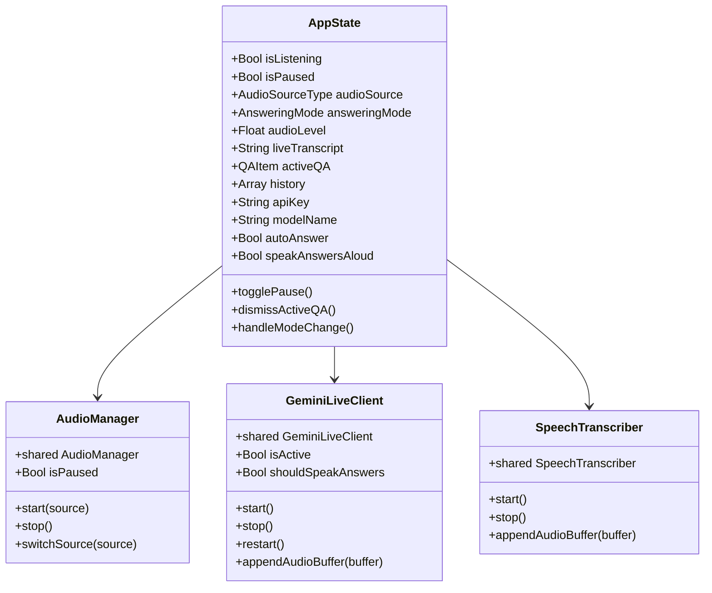

# MyCluely System Architecture

Comprehensive technical architecture and engineering blueprint for **MyCluely**, a native macOS floating HUD application designed for continuous live audio capture and ultra-low-latency real-time AI question answering.

---

## 1. High-Level System Overview

MyCluely continuously listens to microphone and/or system-wide audio (lectures, Zoom meetings, YouTube videos, podcasts), transcribes speech, detects questions, and streams instant, concise AI answers in an always-on-top glassmorphic hovering window.

```mermaid
flowchart TD
    subgraph Audio Capture Layer
        MIC["MicrophoneCapture<br>(AVAudioEngine)"] --> AM["AudioManager<br>(Thread-Safe Coordinator)"]
        SCK["SystemAudioCapture<br>(ScreenCaptureKit SCStream)"] --> AM
    end

    subgraph Audio Processing
        AM --> ABC["AudioBufferConverter<br>(Resamples to 16kHz Mono Float32)"]
    end

    subgraph Multi-Provider Decision Layer
        ABC --> ROUTE{"AppState.answeringMode"}
        ROUTE -->|liveStreaming| PROV{"AppState.aiProvider"}
    end

    subgraph Engine A1: Google Gemini Live Stream
        PROV -->|gemini| GLC["GeminiLiveClient<br>(URLSessionWebSocketTask)"]
        GLC -->|"Int16 PCM Chunks (16kHz, 100ms)<br>wss://...BidiGenerateContent"| GLAPI["Google Gemini Live API<br>(gemini-3.1-flash-live-preview)"]
        GLAPI -->|"serverContent.inputTranscription"| HUD_TRANS["Live Transcript Ticker"]
        GLAPI -->|"serverContent.outputTranscription"| HUD_QA["Live Streaming Answer Card"]
    end

    subgraph Engine A2: OpenAI Live Stream (gpt-realtime)
        PROV -->|openAI| OLC["OpenAILiveClient<br>(URLSessionWebSocketTask)"]
        OLC -->|"Linear Interpolation (16kHz -> 24kHz)<br>wss://api.openai.com/v1/realtime"| OAI["OpenAI Realtime API<br>(gpt-realtime)"]
        OAI -->|"input_audio_transcription.completed"| HUD_TRANS
        OAI -->|"audio_transcript.delta"| HUD_QA
    end

    subgraph Engine B: Local STT + REST API [FALLBACK]
        ROUTE -->|localSTT| ST["SpeechTranscriber<br>(Apple SFSpeechRecognizer)"]
        ST --> QD["QuestionDetector<br>(Grammar & Silence Debouncing)"]
        QD --> AS["AnswerService<br>(gemini-2.5-flash / gemini-3.8-flash)"]
        AS --> HUD_QA
    end

    subgraph Presentation Layer
        HUD_TRANS --> HUD["FloatingHUDWindow (NSPanel)<br>FloatingHUDView (SwiftUI)"]
        HUD_QA --> HUD
    end
```

---

## 2. Audio Capture & Processing Pipeline

### 2.1 Audio Sources
- **Microphone (Default)**: Implemented in `MicrophoneCapture.swift` via `AVAudioEngine.inputNode`. Taps input PCM buffers at hardware sample rate and delivers them to delegate.
- **System Audio**: Implemented in `SystemAudioCapture.swift` via macOS `ScreenCaptureKit` (`SCStream`). Captures internal system output without requiring virtual audio drivers (BlackHole, Soundflower).
- **Both (System + Mic)**: Simultaneously runs both streams, merging and normalizing samples.

### 2.2 Audio Conversion (`AudioBufferConverter.swift`)
The Gemini Live API and Apple Speech both expect **16,000 Hz, single-channel (mono)** audio.
1. Receives raw `CMSampleBuffer` (from ScreenCaptureKit) or `AVAudioPCMBuffer` (from AVAudioEngine).
2. Calculates real-time **RMS Level** across audio frames to drive the HUD equalizer visualizer:
   $$\text{RMS} = \min\left(1.0, \sqrt{\frac{1}{N} \sum_{i=1}^N x[i]^2} \times 5.0\right)$$
3. Uses `AVAudioConverter` to resample variable input formats (e.g. 48kHz / 44.1kHz stereo) down to standard `16,000 Hz Float32 mono`.

### 2.3 PCM Byte Transformation for WebSockets
In `GeminiLiveClient.swift`, `Float32` samples in range $[-1.0, 1.0]$ are converted to signed 16-bit little-endian integer PCM:
$$\text{sample}_{\text{Int16}} = \text{clamp}\Big(\lfloor x \times 32767.0 \rceil, -32768, 32767\Big)$$
- Packaged into **100ms frames** ($1600 \text{ samples} \times 2 \text{ bytes} = 3200 \text{ bytes}$).
- Base64-encoded and sent inside `realtimeInput.audio` frames.

---

## 3. Dual Intelligence Engines

### 3.1 Primary Engine: 24/7 Gemini Live Stream (`GeminiLiveClient.swift`)
- **Transport**: Native WebSocket (`URLSessionWebSocketTask`).
- **Endpoint**:
  ```
  wss://generativelanguage.googleapis.com/ws/google.ai.generativelanguage.v1beta.GenerativeService.BidiGenerateContent?key={API_KEY}
  ```
- **Model**: `models/gemini-3.1-flash-live-preview` (Google's latest low-latency audio model).
- **Session Setup**:
  ```json
  {
    "setup": {
      "model": "models/gemini-3.1-flash-live-preview",
      "generationConfig": {
        "responseModalities": ["AUDIO"]
      },
      "inputAudioTranscription": {},
      "outputAudioTranscription": {},
      "systemInstruction": {
        "parts": [{
          "text": "You are MyCluely, an ultra-fast real-time speech assistant. You listen continuously to audio stream... When a question is asked, give an immediate, concise answer in 1-2 sentences. If no question is asked, stay completely silent."
        }]
      }
    }
  }
  ```
- **Real-Time Streaming**:
  - `serverContent.inputTranscription`: Live text of what the user/speaker said, displayed on the ticker.
  - `serverContent.outputTranscription`: Streaming text of the model's answer, accumulated and rendered live in `QuestionAnswerCard`.
  - `serverContent.turnComplete`: Signals end of generation.
  - `serverContent.interrupted`: Cancels current output if user interrupts with new speech.
- **24/7 Session Resilience**:
  - **`goAway` Handling**: Automatically catches server session rotation signals and reconnects.
  - **Auto-Reconnect**: Detects network dropouts and reconnects with exponential backoff (1.5s to 8.0s).
  - **Pause / Resume**: When paused, emits `{"realtimeInput": {"audioStreamEnd": true}}` to flush server buffers, withholding audio chunks until resumed.
  - **Acoustic Feedback Protection**: Audio playback is muted by default to prevent speaker-to-mic feedback loops; users can toggle "Speak answers aloud" if wearing headphones.

### 3.2 Secondary Live Engine: OpenAI Live Stream (`OpenAILiveClient.swift`)
- **Transport**: Native WebSocket (`URLSessionWebSocketTask`) with custom headers:
  - `Authorization: Bearer <OPENAI_API_KEY>`
  - `OpenAI-Beta: realtime=v1`
- **Endpoint**:
  ```
  wss://api.openai.com/v1/realtime?model=gpt-realtime
  ```
- **16kHz to 24kHz Linear Interpolation Resampling**:
  OpenAI Realtime API requires 24kHz 16-bit linear PCM little-endian. Since MyCluely's audio capture pipeline processes 16kHz Float32 mono, `OpenAILiveClient` resamples on the fly ($N_{out} = \lfloor 1.5 \times N_{in} \rfloor$):
  $$pos = j \times \frac{2}{3}, \quad i = \lfloor pos \rfloor, \quad \alpha = pos - i$$
  $$\text{sample}[j] = (1 - \alpha) \cdot x[i] + \alpha \cdot x[i+1]$$
- **Session Configuration (`session.update`)**:
  ```json
  {
    "type": "session.update",
    "session": {
      "modalities": ["text", "audio"],
      "voice": "alloy",
      "input_audio_format": "pcm16",
      "output_audio_format": "pcm16",
      "input_audio_transcription": { "model": "whisper-1" },
      "turn_detection": { "type": "server_vad", "threshold": 0.5, "silence_duration_ms": 500 }
    }
  }
  ```
- **Real-Time Event Processing**:
  - `conversation.item.input_audio_transcription.completed`: Detected user question text via Whisper-1.
  - `response.audio_transcript.delta`: Streaming assistant answer text tokens for the HUD card.
  - `response.audio.delta`: Streaming 24kHz audio bytes played via `AVAudioPlayerNode` if speech is enabled.
  - `input_audio_buffer.speech_started`: Barge-in detection immediately halts playback when the user starts speaking.
  - `response.done`: Finalizes the generated response card.

### 3.3 Fallback Engine: Local STT + REST API
- **Speech Recognition (`SpeechTranscriber.swift`)**:
  - Apple `SFSpeechRecognizer` continuously recognizes speech.
  - Employs **session rollover** to work around Apple's ~1-minute continuous recognition limit.
- **Question Detection (`QuestionDetector.swift`)**:
  - Syntax pattern matching: Interrogative words (`what`, `why`, `how`, `who`, `when`, `where`, `can you`, `could you`).
  - Terminal punctuation (`?`).
  - Silence debouncing: Waits for a 0.8s pause to ensure question completeness before triggering answer.
  - Deduplication: Prevents answering repeated utterances.
- **REST Generation (`AnswerService.swift`)**:
  - Calls `v1beta/models/{model}:generateContent` with `thinkingBudget: 0`.
  - Automatic fallback chain: `gemini-2.5-flash` $\to$ `gemini-3.8-flash` $\to$ `gemini-flash-latest` $\to$ `gemini-2.5-flash-lite`.

---

## 4. UI Architecture

### 4.1 Window Management (`FloatingHUDWindow.swift`)
- Subclasses `NSPanel` with `.nonactivatingPanel`, `.floating`, and `.fullSizeContentView`.
- Configured with `collectionBehavior = [.canJoinAllSpaces, .fullScreenAuxiliary]` so it hovers over all virtual desktops and full-screen spaces.
- `isMovableByWindowBackground = true` allows smooth dragging anywhere on screen.
- **Dynamic Height Auto-Sizing**:
  - Content height is measured via `ViewHeightKey` (`PreferenceKey`) in SwiftUI.
  - `FloatingHUDWindow.shared?.updateHeight(newHeight)` adjusts the `NSPanel` frame height animatedly while pinning the top-right position on screen, preventing clipping.

### 4.2 Seamless In-Panel Navigation (`FloatingHUDView.swift`)
- **No Detached Popovers**: Replaced clunky `NSPopover` with an in-panel slide transition.
- Clicking `⚙️ Settings` smoothly transitions the primary HUD surface into `SettingsPopoverView`:
  ```swift
  if appState.showSettings {
      SettingsPopoverView(...)
          .transition(.asymmetric(
              insertion: .opacity.combined(with: .scale(scale: 0.96)),
              removal: .opacity.combined(with: .scale(scale: 0.96))
          ))
  } else {
      mainHUDContent
  }
  ```
- Back/Done buttons return cleanly to the live listening interface.

### 4.3 Design System (`Theme.swift`)
- Native Apple glassmorphism: `VisualEffectBlur(material: .hudWindow, blendingMode: .behindWindow)`.
- Vibrant accents: Electric blue accent, emerald green listening, amber paused, cyber cyan live streaming.
- Native macOS switches (`.toggleStyle(.switch)`) and segmented pills.

---

## 5. State Management & Threading Model



### Concurrency Rules
1. **`AppState`** is isolated to `@MainActor`. All published properties drive SwiftUI views on the main thread.
2. **`AudioManager`** runs on high-priority audio threads. It uses an internal `NSLock` for pause flags and dispatches RMS updates to `MainActor`.
3. **`GeminiLiveClient`** operates on a dedicated serial background queue (`com.mycluely.geminilive`, QoS `.userInitiated`). Converts PCM and handles WebSockets off the main thread.
4. **`SpeechTranscriber`** operates on a dedicated background queue (`com.mycluely.speechtranscriber`).

---

## 6. Persistence & Configuration Keys

Non-sensitive configuration is stored in `NSUserDefaults` (`com.mycluely.MyCluely` with backward compatibility to `audiohud_*`). Sensitive account records, provider keys, and sessions use Keychain with `kSecAttrAccessibleWhenUnlockedThisDeviceOnly`. Legacy plaintext account/key fields are migrated and removed only after the secure copy is verified; legacy sessions are invalidated.
| Key | Type | Default | Description |
|---|---|---|---|
| `mycluely_audio_source` | String | `"Microphone"` | Active audio capture source |
| `mycluely_answering_mode` | String | `"24/7 Cloud Live (Gemini Live)"` | Intelligence engine mode |
| `mycluely_model_name` | String | `"gemini-3.8-flash"` | Fallback REST model name |
| `mycluely_auto_answer` | Bool | `true` | Auto-trigger answer generation |
| `mycluely_speak_answers_aloud` | Bool | `false` | Synthesized voice playback |

---

## 7. Build, Packaging & Code Signing

### 7.1 Compiler Invocations
Built with `swiftc` directly via `Scripts/build.sh`.
- Requires `-Xfrontend -disable-sandbox` to permit Swift macro evaluation (`@Observable`, `@State`) and writing to clang module cache.
- Uses a fresh temporary module cache under `.build/` for each build to avoid stale absolute-path compiler caches.
- Output: `build/MyCluely.app/Contents/MacOS/MyCluely` and a metadata-free signed `build/MyCluely.zip`. Bundle assembly/signing takes place under `/private/tmp` before installation to avoid Finder/File Provider metadata races. The build requires strict signature verification.

### 7.2 macOS Privacy Permissions & Code Signing
macOS TCC controls microphone, screen/system audio recording, and speech permissions. `NSMicrophoneUsageDescription` and `NSSpeechRecognitionUsageDescription` explain data use. System audio uses ScreenCaptureKit and the user's screen/system audio recording grant; the app registers only an audio output handler and saves no video frames. `NSSystemAdministrationUsageDescription` is not a screen recording declaration and has been removed.

Development builds are ad-hoc signed with Hardened Runtime and `com.apple.security.device.audio-input`. They do not enable App Sandbox. The build uses the default signing requirement rather than trusting any binary with the same bundle identifier. Production releases need Developer ID signing and notarization; test TCC and Keychain behavior with that release identity. Each launch or sign-in also asks before starting capture.
