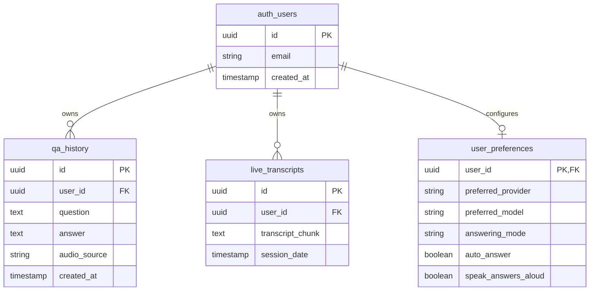

# MyCluely 🎙️⚡💡

> **Ultra-lightweight native macOS floating HUD for real-time speech monitoring and instantaneous AI question answering.**

MyCluely hovers unobtrusively on your screen while continuously capturing speech from your **Microphone**, **System Audio** (Zoom, Google Meet, YouTube, podcasts), or **Both**. It detects questions as they are spoken and streams direct, concise AI answers with minimum latency.

Powered by **Google Gemini Live** (`gemini-3.1-flash-live-preview`) and **OpenAI Live** (`gpt-realtime`) over bi-directional WebSockets with a selectable on-device Apple Speech + REST mode.

---

## ✨ Features

- ⚡ **Multi-Provider 24/7 Cloud Live Audio Streaming**:
  - **Google Gemini Live (`gemini-3.1-flash-live-preview`)**: Continuously streams raw 16kHz PCM audio packets over WebSockets with zero local transcription bottleneck.
  - **OpenAI Live (`gpt-realtime`)**: Real-time 24kHz bi-directional WebSocket audio streaming to `wss://api.openai.com/v1/realtime?model=gpt-realtime` with automatic linear interpolation resampling (16kHz to 24kHz), Whisper-1 transcription, streaming HUD answer cards, and low-latency audio playback.
  - Sub-second streamed answers that flow token-by-token onto the floating HUD.
  - Built-in 24/7 resilience with automatic session rotation and exponential backoff reconnection.
- 🎙️ **Microphone & System Audio Capture**:
  - **Microphone (Default)**: Instant voice Q&A out of the box with zero screen-recording overhead.
  - **System Audio**: Native internal audio capture using Apple's `ScreenCaptureKit` (no virtual audio drivers like BlackHole or Soundflower required).
  - **System + Mic**: Listen to both sides of meetings and discussions simultaneously.
- 🪟 **Floating Glassmorphic HUD**:
  - Always-on-top hovering window (`NSPanel` with `.floating` window level).
  - Visible across all macOS virtual spaces and full-screen apps.
  - Smoothly draggable anywhere on your screen.
  - **Dynamic Auto-Resizing**: Automatically expands or contracts its height to fit live content without clipping.
  - **Pill Mode**: Collapse into an ultra-compact mini bar when you just want background monitoring.
  - **Live Provider Badge**: Displays active engine status pill (`Gemini 3.1` or `GPT-Live-1`) in real time.
- 🎨 **Unified In-Panel Settings**:
  - No awkward detached popover windows or pointer arrows.
  - Clicking `⚙️` smoothly flips into a clean Apple-style configuration card right inside the floating HUD.
  - Switch providers (`Google Gemini Live` ↔ `OpenAI Realtime (gpt-realtime)`) with a single click.
  - Dedicated API key inputs with 1-click clipboard paste.
- 🧠 **Dual Intelligence Engines**:
  1. **24/7 Cloud Live Streaming** *(Default)*: Raw audio WebSockets (Gemini Live or OpenAI gpt-realtime) for maximum speed and intelligence.
  2. **Local STT + Fast REST**: Apple `SFSpeechRecognizer` with syntactic question detection and REST fallback.
- 📋 **Productivity Shortcuts**:
  - Global hotkeys (`Cmd + Shift + P` to pause, `Cmd + Shift + H` to toggle HUD).
  - 1-click clipboard copy (📋) for answers.
  - Session history drawer to review recent questions and answers.
- 🔐 **Application Lock & User Authentication**:
  - **Login & Password**: Secure login and sign-up with email and password protected by PBKDF2-HMAC-SHA256 (600,000 iterations) with random salts and Keychain persistence.
  - **Google Sign-In & Sign-Up**: Full support for signing in and signing up using Google, including Google OAuth 2.0 PKCE and interactive account connect.
  - **Per-User Multi-Provider API Keys**: Isolated storage for both Gemini and OpenAI API keys saved directly in the user's account credentials. Dynamic activation prompt guides new users to enter the key for their selected provider.
  - **Gated Intelligence**: Microphones, audio taps, and live WebSockets remain completely inactive and locked until authenticated.
  - **Quick Sign Out**: Instant lock and sign-out from the macOS Status Bar menu or HUD Settings card.
- 🪶 **Ultra-Lightweight Footprint**:
  - Built purely in Swift 6, AppKit, and SwiftUI.
  - **2.4 MB** total binary size.
  - Zero Electron, zero webviews, minimal RAM usage (~25MB).

---

## 🚀 Quick Start

### 1. Prerequisites
- macOS 14.0 (Sonoma) or newer.
- Xcode Command Line Tools installed (`xcode-select --install`).
- A Google Gemini API key (Free at [Google AI Studio](https://aistudio.google.com/app/apikey)).

### 2. Build from Source
From the project root:
```bash
bash Scripts/build.sh
```
This compiles the Swift sources and produces an ad-hoc signed `build/MyCluely.app`.

### 3. Launch MyCluely
```bash
open build/MyCluely.app
# or
bash Scripts/run.sh
```

---

## ⚙️ Configuration & Setup

1. **Enter Your Gemini API Key**:
   - Click the gear icon (**⚙️**) on the floating HUD.
   - Paste your Gemini API key (or click the **Paste** button).
   - MyCluely automatically connects to the Gemini Live WebSocket stream (`🟢 Live Cloud Streaming Active`).
2. **Choose Audio Capture Source**:
   - Select **Microphone** (default), **System Audio**, or **System + Mic**.
3. **Select Intelligence Engine**:
   - **24/7 Cloud Live (Gemini Live)**: Recommended for minimum latency.
   - **Local STT + Fast REST**: Alternative mode running Apple Speech recognition locally.
4. **Permissions**:
   - **Microphone**: Needed for mic capture. macOS will prompt on first use.
   - **Screen & System Audio Recording**: Only required if selecting System Audio (ScreenCaptureKit audio tap). Enable in *System Settings > Privacy & Security > Screen & System Audio Recording*.

---

## ⌨️ Shortcuts & Controls

| Shortcut / Control | Action | Description |
|---|---|---|
| `Cmd + Shift + P` | **Pause / Listen** | Instantly pause or resume audio listening |
| `Cmd + Shift + H` | **Toggle HUD** | Show or hide the floating HUD window |
| `⏸ Pause` / `▶ Listen` | **HUD Button** | One-click pause toggle with status indicator |
| `⚙️ Settings` | **In-Panel Settings** | Configure API key, audio source, and preferences |
| `📜 History` | **Session History** | Toggle drawer showing recent Q&As |
| `➖ / ⤢` | **Pill / Card Mode** | Collapse to minimal pill or expand to full card |
| `📋 Copy` | **Copy Answer** | Copy generated answer to macOS clipboard |
| `✕ Dismiss` | **Dismiss Card** | Dismiss the active question/answer card |

---

## 🛠️ Project Structure

```
MyCluely/
├── Sources/
│   ├── App/
│   │   ├── Main.swift                    # Application entry point (@main)
│   │   └── AppDelegate.swift             # App lifecycle, status bar menu, global shortcuts
│   ├── Auth/
│   │   ├── AuthModels.swift              # User profile, provider, and error models
│   │   ├── AuthStorage.swift             # Cryptographic hashing & secure account/session storage
│   │   ├── AuthManager.swift             # Main auth manager (Sign In, Sign Up, Sign Out)
│   │   └── GoogleOAuthService.swift      # Google OAuth 2.0 PKCE & ASWebAuthenticationSession
│   ├── AI/
│   │   ├── GeminiLiveClient.swift        # 24/7 WebSocket client for Gemini Live API
│   │   ├── OpenAILiveClient.swift        # Real-time WebSocket client for OpenAI gpt-realtime
│   │   ├── AnswerService.swift           # REST API client with model fallback chain
│   │   └── KeychainHelper.swift          # Secure credential storage
│   ├── Audio/
│   │   ├── AudioManager.swift            # Master audio coordinator (pause/resume, routing)
│   │   ├── AudioBufferConverter.swift    # 16kHz mono converter & audio RMS level meter
│   │   ├── MicrophoneCapture.swift       # Input capture via AVAudioEngine
│   │   └── SystemAudioCapture.swift      # System-wide audio tap via ScreenCaptureKit
│   ├── Speech/
│   │   ├── SpeechTranscriber.swift       # Apple SFSpeechRecognizer with rollover
│   │   └── QuestionDetector.swift        # Question grammar and debouncing engine
│   ├── Model/
│   │   ├── AppState.swift                # Observable state (sources, engines, Q&A)
│   │   └── QAItem.swift                  # Question & answer data model
│   └── UI/
│       ├── FloatingHUDWindow.swift       # Custom NSPanel with dynamic height auto-sizing
│       ├── FloatingHUDView.swift         # Root SwiftUI view with in-panel transitions
│       ├── AuthView.swift                # Login, Sign Up, and Google Auth card
│       ├── ApiKeyPromptView.swift        # Post-login Gemini API key prompt card
│       ├── GoogleSignInSheet.swift       # Interactive Google Sign-In & account connect
│       ├── TranscriptLiveView.swift      # Real-time equalizer & live speech ticker
│       ├── QuestionAnswerCard.swift      # Streaming answer card with copy & dismiss
│       ├── SettingsPopoverView.swift     # In-panel settings & Account view
│       └── Theme.swift                   # Glassmorphic colors, materials, and tokens
├── Resources/
│   └── Info.plist                        # macOS permissions & LSUIElement accessory config
├── Scripts/
│   ├── build.sh                          # Compilation & hardened runtime signing
│   └── run.sh                            # Process launcher
├── Tests/
│   ├── AuthManagerTests.swift            # Unit test suite for authentication and hashing
│   ├── QuestionDetectorTests.swift       # Unit test suite for question detection
│   └── AudioBufferConverterTests.swift   # Unit test suite for audio conversion
├── Architecture.md                       # In-depth system architecture & protocol documentation
└── README.md                             # Project overview & documentation
```

---

## ☁️ Cloud Backend & Database Roadmap (Supabase Integration)

> **Architectural Decision for Downstream Agents & Contributors**:  
> To transition from local storage (`UserDefaults`/`Keychain`) to a robust, scalable cloud infrastructure, **Supabase** is the designated backend platform. It provides enterprise-grade authentication, a relational PostgreSQL database with Row-Level Security (RLS), and zero-dependency REST endpoints that keep MyCluely's lightweight footprint (~2 MB) intact without bulky SDKs.

### 📐 Entity-Relationship Architecture



### 📋 Phased Implementation Plan for Agents

#### Phase 1: Supabase Auth & Google OAuth
- **Endpoint Design**: Connect using native Swift `URLSession` against Supabase's Auth API:
  - Sign Up: `POST https://<project-ref>.supabase.co/auth/v1/signup`
  - Sign In: `POST https://<project-ref>.supabase.co/auth/v1/token?grant_type=password`
  - Google OAuth: Use Supabase's native Google Provider endpoint with PKCE flow.
- **Session Tokens**: Store JWT access and refresh tokens securely in Apple Keychain (`com.mycluely.supabase.tokens`).
- **Zero-SDK Footprint**: Avoid importing heavy multi-megabyte binary SDKs; utilize pure Swift Codable models and `URLSession` to preserve the ~2.1 MB total app binary size.

#### Phase 2: Q&A History & Transcript Persistence
- **Table Setup**: Execute the PostgreSQL schema below in the Supabase SQL editor.
- **Row-Level Security (RLS)**: Enforce `auth.uid() = user_id` on all tables so users can only ever access their own data.
- **Offline-First Synchronization**: Cache Q&A items and transcripts locally in SQLite/JSON first; dispatch background sync tasks to Supabase when network connectivity is active.

#### Phase 3: Cross-Device Settings & Preferences
- Sync active model selection, answering mode, audio capture source defaults, and Gemini API keys across user devices.

---

### 🗄️ Starter PostgreSQL Schema (Supabase SQL Editor)

```sql
-- 1. Profiles Table
CREATE TABLE public.profiles (
    id UUID PRIMARY KEY REFERENCES auth.users(id) ON DELETE CASCADE,
    email TEXT NOT NULL,
    display_name TEXT,
    avatar_url TEXT,
    created_at TIMESTAMPTZ DEFAULT TIMEZONE('utc'::text, NOW()) NOT NULL
);

-- 2. Q&A History Table
CREATE TABLE public.qa_history (
    id UUID PRIMARY KEY DEFAULT gen_random_uuid(),
    user_id UUID REFERENCES auth.users(id) ON DELETE CASCADE NOT NULL,
    question TEXT NOT NULL,
    answer TEXT NOT NULL,
    audio_source TEXT NOT NULL,
    created_at TIMESTAMPTZ DEFAULT TIMEZONE('utc'::text, NOW()) NOT NULL
);

-- 3. Transcripts Table
CREATE TABLE public.live_transcripts (
    id UUID PRIMARY KEY DEFAULT gen_random_uuid(),
    user_id UUID REFERENCES auth.users(id) ON DELETE CASCADE NOT NULL,
    transcript_chunk TEXT NOT NULL,
    session_date TIMESTAMPTZ DEFAULT TIMEZONE('utc'::text, NOW()) NOT NULL
);

-- 4. Enable Row Level Security (RLS)
ALTER TABLE public.profiles ENABLE ROW LEVEL SECURITY;
ALTER TABLE public.qa_history ENABLE ROW LEVEL SECURITY;
ALTER TABLE public.live_transcripts ENABLE ROW LEVEL SECURITY;

-- 5. RLS Policies (Users can only read & write their own records)
CREATE POLICY "Users can manage own profile" ON public.profiles
    FOR ALL USING (auth.uid() = id);

CREATE POLICY "Users can manage own qa_history" ON public.qa_history
    FOR ALL USING (auth.uid() = user_id);

CREATE POLICY "Users can manage own transcripts" ON public.live_transcripts
    FOR ALL USING (auth.uid() = user_id);
```

---

## 📖 Deep Technical Architecture

For an in-depth explanation of the system design, WebSocket protocol schema, PCM byte conversion mathematics, threading model, and code signing requirements, see [**Architecture.md**](Architecture.md).

---

## 📄 License

[MIT License](LICENSE). Third-party dependencies and fonts retain their own licenses; see [THIRD_PARTY_NOTICES.md](THIRD_PARTY_NOTICES.md). Designed with native Apple frameworks and Google Gemini.


## Security and privacy

API keys, password verifiers, account profiles, and the active session are saved in the macOS Keychain. Ordinary settings and the public Google OAuth client ID use UserDefaults. The app migrates old plaintext preferences after Keychain unlock; a failed migration preserves the legacy values for retry. Legacy sessions require sign-in again. Older password hashes are upgraded after a successful password login. Old unassigned global API keys are retained only in Keychain for recovery and are never shared across accounts.

Each launch/sign-in asks before listening. Cloud Live streams selected microphone/system audio to Gemini or OpenAI. Local STT requires on-device Apple Speech support and sends detected question text to Gemini when auto-answer is enabled; it is not an offline answering mode. The app keeps transcripts and Q&A in memory, clears them on sign-out, and omits speech, keys, headers, and provider response bodies from diagnostics. Provider-side retention follows the provider's terms. Obtain participants' consent before capturing conversations.

Google sign-in requires your own **iOS/macOS OAuth client** and its registered reverse-client-ID callback scheme. The email-only quick sign-in has been removed. Accounts created with that old shortcut cannot authenticate as verified Google identities; recover their local keys and recreate those profiles. There is no remote account backend in the current app. Local accounts and an editable native app are not an authorization boundary for server-side resources.

Run `./Scripts/test_security.sh` for isolated offline regression checks, and `python3 Scripts/security_scan.py --include-generated` for a redacted heuristic scan. Live OpenAI tests require explicit `MYCLUELY_RUN_LIVE_TESTS=1` and `OPENAI_API_KEY` configuration and can incur provider charges. `./Scripts/verify_auth.sh` reports storage presence only.

See [SECURITY_AUDIT.md](SECURITY_AUDIT.md) for the audit results, remaining release checks, and publication checklist. Development builds are ad-hoc signed; distribute releases using a trusted Developer ID and notarization.
